# PRODUCTION_ARCHITECTURE.md

**System:** Multi-tenant AI WhatsApp sales assistant (e-commerce RAG)
**Base repository:** `nestjs-auth-boilerplat` (Project C)
**Inherited ideas from:** `anotherwizabot` — OpenWA / DukkanAI (Project A, NestJS MVP) and `WizaBotWrapperFinalPlease` — Fahim (Project B, FastAPI MVP)
**Status:** Architecture proposal — not yet implemented

---

## Table of Contents

1. [Executive Summary](#1-executive-summary)
2. [Current Repository Analysis](#2-current-repository-analysis)
3. [MVP Comparison](#3-mvp-comparison)
4. [What We Keep / Remove / Rewrite / Merge / Defer](#4-what-we-keep--remove--rewrite--merge--defer)
5. [Production Architecture](#5-production-architecture)
6. [High-Level System Design](#6-high-level-system-design)
7. [System Context](#7-system-context)
8. [Runtime Flows](#8-runtime-flows)
9. [Low-Level Module Design](#9-low-level-module-design)
10. [Module Dependency Graph](#10-module-dependency-graph)
11. [WhatsApp Architecture](#11-whatsapp-architecture)
12. [RAG Architecture](#12-rag-architecture)
13. [Agent Architecture](#13-agent-architecture)
14. [Database Architecture](#14-database-architecture)
15. [PostgreSQL Schema Strategy](#15-postgresql-schema-strategy)
16. [API Architecture](#16-api-architecture)
17. [Events and Queues](#17-events-and-queues)
18. [Security](#18-security)
19. [Reliability](#19-reliability)
20. [Observability](#20-observability)
21. [Testing Strategy](#21-testing-strategy)
22. [Production Deployment Architecture](#22-production-deployment-architecture)
23. [Architectural Decisions / ADRs](#23-architectural-decisions--adrs)
24. [Migration Strategy](#24-migration-strategy)
25. [Agentic Coding Strategy](#25-agentic-coding-strategy)
26. [Initial Coding Tasks](#26-initial-coding-tasks)
27. [Development Rules](#27-development-rules)
28. [Definition of Done](#28-definition-of-done)
29. [Project Documentation](#29-project-documentation)

---

## 1. Executive Summary

The three repositories describe **one business**: a multi-tenant WhatsApp AI sales assistant for e-commerce shops (primarily Algerian / Arabic-French-English market). A shop owner registers, connects a WhatsApp number, ingests a product catalog, and an LLM auto-answers customers in their language using RAG grounded in that catalog.

This document consolidates the two MVPs into **one production NestJS modular monolith**, built **on top of the NestJS boilerplate (Project C)**.

Three conclusions that deliberately challenge the natural "merge everything" reading of the task:

1. **WhatsApp gateway must be an external deployable component, not embedded in the application.** The user's proposed `IWhatsAppProvider` port + factory + adapters is correct and is adopted. But the default adapter talks to **OpenWA (Project A) running as a standalone service over its HTTP API + webhooks**, exactly like Project B talks to Evolution API — it does **not** embed Project A's engine layer (Baileys session management) inside the business monolith. Project A's own docs confirm the engine layer is in-process, stateful, and single-instance; embedding it would recreate a second product inside the monolith and destroy horizontal-scaling and agent-friendliness.

2. **One PostgreSQL database, one `public` schema, module-owned tables by convention — not schema-per-module.** TypeORM's schema support adds real complexity (qualified migrations, `search_path`, cross-schema FKs) with little benefit at this scale. The modules are bounded contexts **in code**, and every row is tenant-scoped by a `tenant_id` column. Schema-per-module is listed as a future evolution path, not a starting decision.

3. **RAG lives inside the monolith** (no microservice), reusing **Project B's retrieval ideas** (HyDE / multi-query rewriting, hybrid dense+sparse+RRF, reranking, parent expansion, live stock enrichment) and **Project A's robustness ideas** (provider circuit breakers + fallback chain, hallucination guard, conversation memory, idempotent ingestion).

The result is a system that is **simpler than either MVP**, keeps the good ideas, and is small enough that an AI coding agent can safely modify one feature without understanding the whole codebase.

---

## 2. Current Repository Analysis

### 2.1 Project A — `anotherwizabot` (NestJS MVP — OpenWA + DukkanAI)

**What it is.** Two products in one repo: **OpenWA** (a generic self-hosted WhatsApp API gateway: sessions, messages, webhooks, WebSockets, plugins, MCP server, Docker-first) plus **DukkanAI** (a branded multi-tenant AI e-commerce overlay: tenant accounts, JWT+OTP, points/billing scaffolding, LLM brain with RAG, auto-replies).

**Architecture.** NestJS 11 + TypeScript 5 + TypeORM. Modular monolith with **two database connections** (`main` = auth/tenant/audit, `data` = session/message/RAG), pluggable SQLite→PostgreSQL, Redis (ioredis) optional, BullMQ optional, socket.io events, React 19 dashboard served from the same port.

**The WhatsApp layer (the heart).** One abstraction (`IWhatsAppEngine`, ~500 lines), two implementations (Baileys adapter ~1,321 lines; whatsapp-web.js adapter), one factory (`EngineFactory`), one orchestrator (`SessionService` ~1,392 lines). Per-session in-memory engine map, reconnect with capped exponential backoff (≤20 attempts), QR/pairing code, LID→phone resolution, neutral JID dialect. A full session state machine.

**AI/RAG.** `AgentService` (thin orchestrator) → `ConversationService` (Redis LRU, last 6 turns) → `RetrievalService`/`HybridSearchService` (pgvector cosine + Postgres FTS + RRF, top-5) → `LlmService` (Gemini/OpenAI/Qwen with opossum circuit breakers and a fallback chain) → hallucination guard (max chunk score < 0.3 → escalation + canned reply).

**Auth.** Two coexisting stacks: classic API keys (`owa_k1_...`, HMAC/SHA-256 hashed, roles ADMIN>OPERATOR>VIEWER, IP allow-lists, session scoping) and tenant JWT (register → bcrypt(12) → email OTP → access 15 min + rotating refresh 7 days with reuse detection). Separate admin JWT secret. Guards order: Throttler → ApiKey → JwtTenant → Admin.

**Other.** Webhooks outbound with HMAC + retries + SSRF guard + smart filters; full plugin system with sandboxed worker threads; MCP server (39 tools); socket.io events; Prometheus metrics; audit log; health checks; graceful shutdown; boot-time secret guards; Docker/`docker-proxy` infra orchestration; S3/MinIO storage.

**Strengths.**
- Exceptionally well-documented (24 docs + EXPLAINED.md) and heavily unit-tested (300+ spec files).
- The engine abstraction concept is sound (interface segregation is poor, but the direction is right).
- Strong security instincts: HMAC webhooks, SSRF guards, secret refusal at boot, IP allow-lists, hashed API keys, refresh-token rotation families.
- Solid production hardening: graceful shutdown, boot secret guards, forced Baileys in prod, process hardening.
- Good webhook/queue retry ideas and the LID problem is handled head-on.

**Weaknesses (why we do not transplant it wholesale).**
- **Massive scope creep for this business.** It is a WhatsApp gateway product plus a plugin marketplace plus an infra-orchestration dashboard plus an MCP server plus a business app. Most of this is irrelevant to "AI sales assistant".
- **God classes**: `SessionService` (1,392 lines), `BaileysAdapter` (1,321 lines), a 500-line interface. Not agent-friendly.
- **In-process session state** (`Map<string, IWhatsAppEngine>`); docs admit single-instance, no horizontal scaling.
- **Two database connections** add operational complexity (migrations per connection, cross-connection references).
- **Two auth stacks** (API keys + tenant JWT) duplicate work; RAG metering is scaffolded but *nothing calls the deduction functions yet*.
- FTS is hard-coded to English (`to_tsvector('english')`) which is wrong for an Arabic/French/Darija product.
- Plugins + hooks + sandboxing = over-engineering for the actual product.
- Storage/export/import, Docker daemon orchestration inside the app, media tar-streaming — none needed here.

### 2.2 Project B — `WizaBotWrapperFinalPlease` (FastAPI MVP — Fahim)

**What it is.** The pure business product: multi-tenant e-commerce RAG WhatsApp assistant. No generic gateway ambitions.

**Architecture.** FastAPI (Python 3.11) + asyncpg + raw SQL + pgvector + Redis (streams + cache) + Evolution API v2 (external self-hosted WhatsApp gateway) + React 18 dashboard. One `api` service + one `worker` service (ingestion).

**RAG (the best part).** Full pipeline: **query rewrite (direct / HyDE / multi-query)** → embed → **hybrid search (pgvector dense + Postgres FTS/BM25 sparse + RRF)** → **rerank** → **parent expansion** → **live stock enrichment** (products table merged into chunk metadata at query time so the AI always sees current stock). Trilingual default system prompt. Provider-agnostic LLM router (Gemini/OpenAI/Qwen) with per-tenant provider choice. SSE streaming chat.

**Auth.** JWT + API keys (hashed) + **email OTP 2FA on new devices** (trusted-device flag in Redis) + bcrypt. Tenant isolation is the "THE security rule": `tenant_id` on every table, composite PK `(chunk_id, tenant_id)`, `WHERE tenant_id` on every query.

**Async.** Redis Streams consumer group worker for bulk ingestion (batch 10, XACK only successes).

**Billing.** Points-based (1 pt/message, 2 if >600 tokens), plan-based RPM (starter 20 … enterprise 500) sliding-window rate limits, `usage_events` + a `deduct_points()` DB trigger.

**Strengths.**
- Business-model clarity: tenants, products, conversations, usage — exactly what we ship.
- The RAG retrieval design is **better than Project A's**: rewriting, reranking, parent expansion, live stock.
- OTP 2FA + trusted devices is a real, working flow.
- Composite-PK tenant isolation in the vector store is correct.
- Real production learning about Evolution API + the `@lid` nightmare is captured in `jid_resolver.py`.

**Weaknesses.**
- `waha_webhook.py` (348 lines) is a **god-handler**: parses fragile Evolution payload shapes, runs the *entire RAG + LLM + send synchronously inside the webhook* (timeout/retry risk), leaves debug `logger.warning` spam in production code, and uses an **in-memory** dedup cache (non-distributed, lost on restart).
- **Three WhatsApp lanes** (Evolution primary, legacy Meta Cloud API, and a dead `baileys-service/` Node.js duplicate). Two of them should be deleted.
- **Double-deduction bug** risk: the `deduct_points` trigger *and* Python-side deduction both exist (the docs warn about it).
- Raw SQL everywhere with 9 hand-applied `.sql` migrations (Alembic is pinned in requirements but unused).
- Only 2 test files. No graceful shutdown, no retries for sending, no webhook signature beyond a path secret.

### 2.3 Project C — `nestjs-auth-boilerplat` (Production Starting Point)

**What it is.** A deliberately small, production-friendly NestJS 11 starter: JWT auth (access + refresh rotation via HttpOnly cookie + `user_sessions` table), users, payments example (provider port + idempotency), PostgreSQL + TypeORM migration-first (`synchronize: false`), Swagger, Jest unit + Docker-backed integration tests.

**Architecture.** Clean feature pattern: each API surface = one `{Xxx}Endpoint` (controller) + one `{Xxx}Handler` (use case) in `modules/<name>/features/`. Shared `common/`:
- `common/domain` — base `Entity` with UUID id, `createdOnUtc`, and **domain-event primitives**.
- `common/auth` — JWT strategy, guard, `@CurrentUser()` decorator.
- `common/swagger` — Swagger setup + reusable response decorators.
- `database` — runtime + CLI TypeORM configs, `create-database.ts`, migration bootstrap.

**Strengths.**
- Small, predictable, KISS. The **feature-handler pattern is the single most agent-friendly pattern** in any of the three repos: an AI agent can read one file and see the whole feature (DTO + validation + endpoint + handler + errors).
- Migration-first database with the exact tooling already wired (`db:init`, `db:migration:run`, etc.).
- Provider-port abstraction is demonstrated once (payments) — the pattern we repeat for WhatsApp and LLM.
- Domain-event primitives ready to use when an event is genuinely warranted.
- Testing harness (unit + integration against ephemeral Postgres) already works.

**Weaknesses (gaps to fill, not flaws).**
- Payments module is a placeholder (`InMemoryPaymentService`); not part of the product — will be removed or parked.
- No rate limiting, audit log, email delivery, health checks, or structured logging yet (README lists these as next steps).
- Single-tenant mental model (users only) — needs the tenant dimension.
- No async/queue infrastructure.

---

## 3. MVP Comparison

| Category | Project A (OpenWA/DukkanAI) | Project B (Fahim) | Project C (Boilerplate) |
|---|---|---|---|
| Framework | NestJS 11 + TypeScript 5 | FastAPI + Python 3.11 | NestJS 11 + TypeScript 5 |
| Architecture | Modular monolith, 2 DB connections | Monolith (api + worker processes) | Small modular monolith |
| WhatsApp | Own engine abstraction (Baileys / wweb.js embedded) | External **Evolution API** v2 | None |
| WhatsApp session mgmt | Full state machine, QR/pairing, reconnect, LID | Delegated to Evolution; `@lid` resolver + instance-name mapping | None |
| RAG | Dense+sparse+RRF, hallucination guard, English FTS only | **HyDE/multi-query + rerank + parent expand + live stock** | None |
| LLM | 3 providers, circuit-breaker fallback chain | 3 providers, per-tenant choice | None |
| Ingestion | Sync, idempotent by contentHash | **Async via Redis Streams worker** | None |
| Database | TypeORM, SQLite (data) / PG pluggable | Raw SQL + pgvector, hand-applied `.sql` | **TypeORM migration-first, PG** |
| Auth | API keys + tenant JWT + admin JWT, refresh rotation | JWT + API keys + **OTP 2FA + trusted devices** | JWT + **refresh rotation**, no OTP |
| Queues | BullMQ (webhook only, optional) | Redis Streams (ingestion only) | None |
| Caching | Redis (ioredis), conversation LRU | Redis (history, OTP, limits, JID maps) | None |
| Observability | Health, metrics, audit, structured logs | Prometheus, audit, usage | Basic |
| Testing | 300+ unit specs + e2e | 2 tests | Unit + Docker integration harness |
| Security | HMAC webhooks, SSRF, secret boot guards, IP allow-lists | Tenant-id everywhere, composite PKs | Solid JWT auth |
| Billing | Metering scaffold (unwired) | **Points billing wired** (+ double-deduct bug) | None |
| Docs | 24 docs + 2 explains | PROJECT_GUIDE/README | README + Swagger |
| Scaling | Single instance (admitted) | Single instance + worker | N/A (greenfield) |

**Bottom line per row:** WhatsApp → Project B's *deployment* approach (external gateway) with Project A's *abstraction concept*. RAG → Project B's pipeline + Project A's guard/circuit-breakers. Database → Project C's TypeORM migration-first. Auth → Project C's JWT + Project B's OTP/tenant model. Queues → Project C (none) needs BullMQ added.

---

## 4. What We Keep / Remove / Rewrite / Merge / Defer

| Component | Verdict | Rationale |
|---|---|---|
| **Project C** feature-handler pattern | **KEEP (base)** | Agent-friendly; one file = one feature. This is the new house style. |
| **Project C** JWT auth + refresh rotation + `user_sessions` | **KEEP (base)** | Solid; extend with tenants + OTP. |
| **Project C** migration-first TypeORM + swagger + test harness | **KEEP (base)** | Already correct. |
| **Project C** domain-event primitives | **KEEP** | Use for `message.received`, `conversation.updated` when needed. |
| **Project C** payments module | **REMOVE** | Placeholder provider; not in product scope (points billing replaces it). |
| **Project B** business model (tenants, products, conversations, usage) | **KEEP** | The product. |
| **Project B** RAG pipeline (rewrite/hybrid/rerank/parent/live stock) | **KEEP (rewrite in TS)** | Best retrieval design of the two. |
| **Project B** OTP 2FA + trusted devices | **KEEP** | Working, real flow. |
| **Project B** Evolution adapter pattern | **KEEP** | Reused behind the new port as a non-default adapter. |
| **Project B** `waha_webhook.py` | **REWRITE** | Thin webhook receiver + enqueue job; never run RAG inside the webhook. |
| **Project B** in-memory message dedup | **REWRITE** | Redis/DB dedup via `wa_message_id` unique constraint. |
| **Project B** `deduct_points` DB trigger | **REMOVE** | Double-deduction hazard; deduct once in the application layer in a transaction. |
| **Project B** legacy Meta Cloud API lane | **REMOVE** | Dead lane. |
| **Project B** `baileys-service/` Node duplicate | **REMOVE** | Dead code. |
| **Project B** hand-applied `.sql` migrations | **REMOVE** | Replaced by TypeORM migration-first. |
| **Project A** engine abstraction concept | **KEEP (redesign)** | Slim down to a lean app-level `IWhatsAppProvider` port. |
| **Project A** Baileys/`SessionService`/`IWhatsAppEngine` implementation | **DO NOT EMBED** | Becomes the external OpenWA gateway service. |
| **Project A** webhook HMAC + retries + SSRF guard | **KEEP** | Applied to inbound gateway webhooks and any outbound delivery. |
| **Project A** LLM circuit-breaker fallback chain | **KEEP** | Portable, small. |
| **Project A** hallucination guard + escalation | **KEEP** | Directly reusable. |
| **Project A** conversation memory (Redis) | **KEEP** | Portable. |
| **Project A** LID resolution + `lid_mappings` | **KEEP** | The `@lid` problem is real; persist mappings in DB + cache. |
| **Project A** API-key classic stack | **SIMPLIFY** | Keep only what the product needs (MCP/agent keys). Merge into one IAM module. |
| **Project A** two-DB split | **REMOVE** | One DB. |
| **Project A** plugin system + sandboxing | **REMOVE** | Over-engineering for this product. |
| **Project A** MCP server | **DEFER** | Not a stated requirement; revisit if external agents must drive the bot. |
| **Project A** InfraModule/Docker orchestration | **REMOVE** | Deployment concern, not application concern. |
| **Project A** catalog/channel/status/label/group modules | **REMOVE** | WhatsApp Business features belong to the gateway, not the business app. |
| **Project A** S3/MinIO storage + export/import | **DEFER** | Only if media handling is a requirement. |
| Frontend (both) | **REWRITE (defer full scope)** | Both dashboards are similar React SPAs; rebuild one against the new API. Ship a minimal dashboard first. |
| WhatsApp Business marketing features (groups, labels, channels, catalog, status, templates) | **DEFER** | Not required by the documented product; the gateway exposes them if ever needed. |

---

## 5. Production Architecture

### 5.1 Guiding principles

- **KISS** — one process for the API, one for the queue worker, one external gateway. No microservices.
- **Agent-friendly** — feature-handler pattern everywhere, small focused services, explicit dependencies, minimal magic.
- **Dependency inversion only where it pays** — WhatsApp provider (real replacement value) and LLM provider (real replacement value). Everything else uses direct, explicit application-service calls.
- **Strong module boundaries** — modules own their data and expose `index.ts` public contracts. No cross-module imports of internal implementation files.
- **Migration-first database** — `synchronize: false` in all environments.

### 5.2 Target folder structure (built on Project C)

```text
backend/
├─ src/
│  ├─ main.ts                     # bootstrap, global pipes, swagger, health, shutdown
│  ├─ app.module.ts               # root wiring (kept small)
│  ├─ common/
│  │  ├─ domain/                  # base Entity + domain events  (from C)
│  │  ├─ auth/                    # guards, strategies, decorators  (from C, extended)
│  │  ├─ swagger/                 # setup + response decorators  (from C)
│  │  ├─ config/                  # env schema + typed config + boot secret guards  (A)
│  │  ├─ logging/                 # structured JSON logger + correlation id  (A)
│  │  ├─ errors/                  # typed error classes + error format  (C style)
│  │  ├─ pagination/              # shared pagination helper  (A)
│  │  └─ idempotency/             # idempotency-key storage helper  (C pattern)
│  ├─ database/
│  │  ├─ data-source.ts           # CLI + runtime config  (C)
│  │  ├─ create-database.ts       # (C)
│  │  └─ migrations/              # all TypeORM migrations  (C)
│  ├─ infra/
│  │  ├─ redis/                   # ioredis provider  (C/A)
│  │  ├─ queue/                   # BullMQ module + job names + processors
│  │  ├─ mailer/                  # nodemailer (OTP / reset)  (A/B)
│  │  └─ health/                  # /health, /health/live, /health/ready
│  └─ modules/
│     ├─ iam/                     # users, tenants, api-keys, roles, sessions, OTP
│     ├─ whatsapp/                # provider port + OpenWA/Evolution adapters + link + inbound webhook
│     ├─ conversations/           # conversations, messages, escalations
│     ├─ knowledge/               # products, documents, chunker, embedder, vector store
│     ├─ rag/                     # rewriter, hybrid search, reranker, pipeline
│     ├─ llm/                     # provider port + gemini/openai/qwen + embedder
│     ├─ agent/                   # orchestration, prompt builder, streaming, escalation
│     ├─ billing/                 # usage events, points, plan rate limits
│     ├─ audit/                   # audit log
│     └─ notifications/           # outbound webhooks (deferred) + email
├─ tests/
│  ├─ unit/                       # handlers + pure services
│  ├─ integration/                # Docker-backed Postgres
│  └─ e2e/
├─ docs/                          # see section 29
├─ .env.example
├─ package.json                   # pnpm workspace with src + (optional) web
└─ AGENTS.md                      # agentic rules (section 27)
```

**Every module directory follows the same contract:**

```text
modules/<name>/
├─ index.ts                 # public exports ONLY (the module's contract)
├─ <name>.module.ts
├─ entities/                # TypeORM entities owned by this module
├─ services/                # internal application services
├─ features/                # {Xxx}Endpoint + {Xxx}Handler + DTOs  (from C)
├─ ports/                   # interfaces this module requires (if any)
└─ *.spec.ts                # unit tests colocated
```

### 5.3 Layering rules inside a module

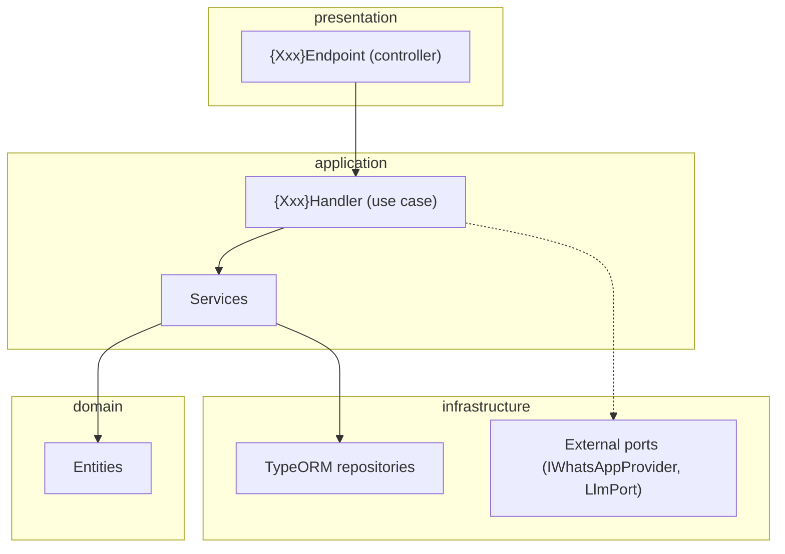

Rules:
- Endpoints only validate + call a handler. Handlers contain the business rule.
- Services may be called by handlers, never by other modules' code directly (use the module's public contract via `index.ts`).
- Entities are TypeORM-decorated but carry no HTTP/transport concerns.
- External providers are injected through ports defined **inside the module that owns the port** (WhatsApp port lives in `whatsapp`, LLM port lives in `llm`).

---

## 6. High-Level System Design

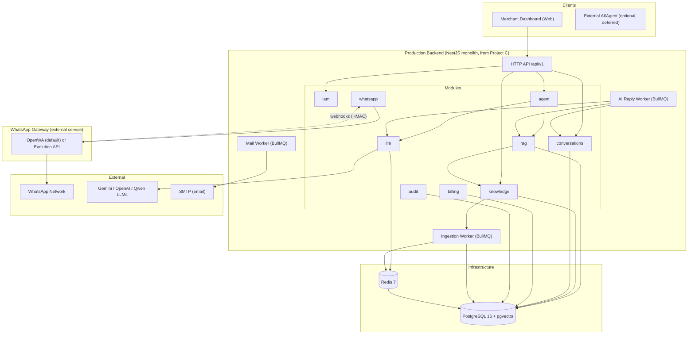

The monolith runs **two processes** from one image: `api` (HTTP + webhooks + BullMQ producer) and `worker` (BullMQ consumers). The gateway is a third container. This is not a microservice architecture — it is one application plus a queue worker, which is the standard production shape of a modular monolith.

---

## 7. System Context

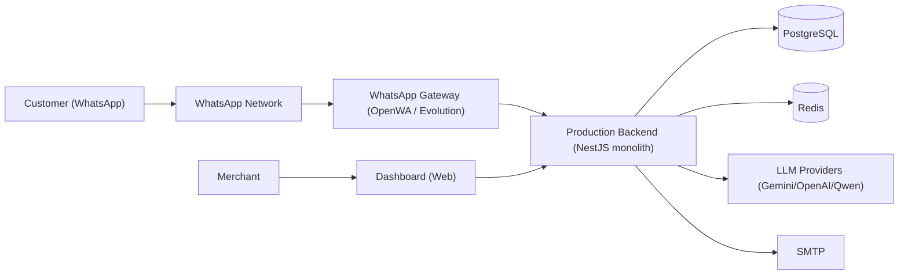

Primary actors: **Customer** (WhatsApp, hands-off), **Merchant** (dashboard), **Platform Admin** (admin API). External systems: WhatsApp gateway, LLM providers, SMTP. Storage: PostgreSQL (relational + vector), Redis (cache/queue/state).

---

## 8. Runtime Flows

### 8.1 Incoming WhatsApp message → AI reply (happy path)

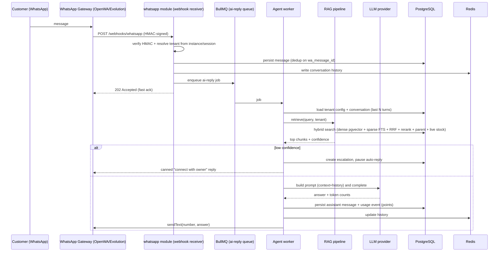

**Design decision:** the webhook only **persists + enqueues**, then ACKs. The AI work happens in the worker. This fixes Project B's failure mode (entire RAG+LLM synchronously in the webhook) and Project A's (AI inline in the engine listener).

### 8.2 Document/product ingestion

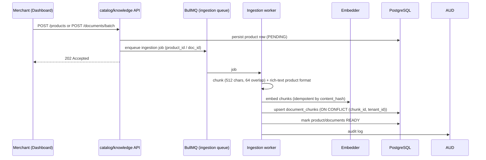

### 8.3 Merchant links WhatsApp

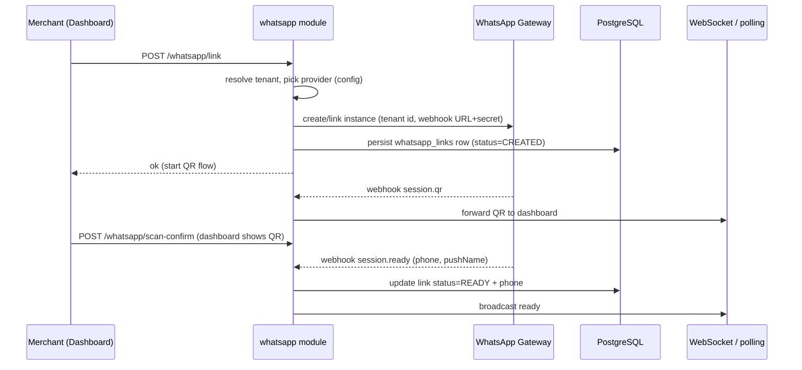

### 8.4 Session/downtime recovery

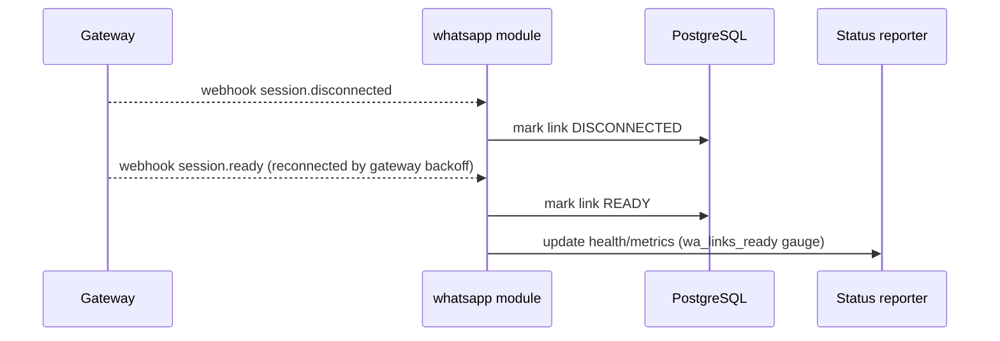

Reconnection, backoff, and QR re-auth are **the gateway's responsibility** (OpenWA/Evolution), not the app's. The app only records status for the dashboard.

---

## 9. Low-Level Module Design

> For every module: **Purpose · Responsibilities · Public API (exports) · Internal components · Owned data · Dependencies · Must-not-depend-on · Events · Tests.**

### 9.1 `iam` — Identity, Tenants & Access

- **Purpose.** Who can log in (users/admin), which shop they belong to (tenants), and how machines authenticate (API keys).
- **Responsibilities.** Register/login/refresh/logout, OTP email verification + trusted devices, password reset, tenant CRUD + plan + settings, API key issuance/revocation, role authorization.
- **Owned data.** `users`, `user_sessions`, `tenants`, `tenant_api_keys`, `roles` (optional), `audit` is separate module but written here.
- **Public API.** `IamService` (registerTenant, login, refresh, logout, verifyOtp, issueApiKey, getTenantProfile, updateTenantSettings); guards (`JwtAuthGuard`, `AdminGuard`, `@CurrentUser`, `@RequireRole`).
- **Internal components.** `features/` (auth-register, auth-login, auth-refresh, auth-logout, otp-verify, forget/reset-password, tenants, api-keys), `services/` (otp, mailer client, jwt, password-hash, api-key-hash).
- **Dependencies.** TypeORM repositories, `infra/redis`, `infra/mailer`, `infra/queue` (email jobs).
- **Must NOT depend on.** `whatsapp`, `rag`, `llm`, `knowledge`, `conversations`.
- **Events.** `tenant.created` (domain event) → provisioning default settings.
- **Tests.** Unit: OTP flow, JWT rotation/reuse detection, API key hashing. Integration: register→verify→login→refresh against real Postgres.

### 9.2 `whatsapp` — Gateway Integration

- **Purpose.** Own the single seam between the app and every WhatsApp provider.
- **Responsibilities.** Provider selection/factory, link/unlink a tenant's WhatsApp, inbound webhook receiver (HMAC verify → persist → enqueue), status/QR surfacing, JID normalization + LID mapping, send-text/media commands.
- **Owned data.** `whatsapp_links` (tenant→gateway instance), `wa_jid_mappings` (lid→phone).
- **Public API (the port).** `IWhatsAppProvider` + `WhatsAppService` (link, unlink, status, getQr, sendText, sendMedia, handleWebhook) + `IInboundMessage` neutral message shape.
- **Internal components.** `provider/whatsapp-provider.factory.ts`, `provider/openwa.adapter.ts` (default), `provider/evolution.adapter.ts` (alternative), `features/` (link-whatsapp, whatsapp-status, whatsapp-webhook, whatsapp-chats).
- **Dependencies.** Config (gateway base URLs, webhook secret), TypeORM repositories, `infra/queue` (ai-reply producer), `common/security` (HMAC verify, SSRF guard).
- **Must NOT depend on.** `rag`, `llm`, `agent` (it only enqueues a job; the worker orchestrates).
- **Events.** `whatsapp.message.received` (job), `whatsapp.link.ready` (WebSocket broadcast).
- **Tests.** Adapter tests with a mocked HTTP client (per adapter), webhook HMAC unit tests, integration: webhook→persist→job.

**Port shape (lean — not Project A's 500-line interface):**

```ts
// modules/whatsapp/ports/whatsapp-provider.port.ts
export interface IWhatsAppProvider {
  readonly name: 'openwa' | 'evolution' | 'meta';
  linkInstance(params: { tenantId: string; webhookUrl: string; webhookSecret: string }): Promise<LinkResult>;
  unlinkInstance(instanceId: string): Promise<void>;
  getInstanceStatus(instanceId: string): Promise<GatewayStatus>;
  getQr(instanceId: string): Promise<string | null>;
  sendText(input: { instanceId: string; to: string; text: string }): Promise<SendResult>;
  sendMedia(input: { instanceId: string; to: string; media: MediaInput }): Promise<SendResult>;
}
```

The app never sees gateway SDK types; every adapter maps to the neutral `IInboundMessage` shape.

### 9.3 `conversations` — Chats & Messages

- **Purpose.** The customer-facing thread log and the conversation memory used by the agent.
- **Responsibilities.** Upsert conversation by (tenant, channel, externalId), append messages, paginate history, mark read/paused, escalations, hidden chats.
- **Owned data.** `conversations`, `messages`, `escalations`.
- **Public API.** `ConversationService` (upsertConversation, appendMessage, getHistory, pauseAutoReply, listConversations, listMessages, escalate).
- **Dependencies.** TypeORM repositories, `infra/redis` (hot history LRU).
- **Must NOT depend on.** `whatsapp`, `rag`, `llm`.
- **Events.** `conversation.message.added` (domain event — used by WebSocket push).
- **Tests.** Unit: history trimming, dedup. Integration: upsert + append against Postgres.

### 9.4 `knowledge` — Products & Documents (ingestion)

- **Purpose.** The corpus the AI answers from.
- **Responsibilities.** Product CRUD + stock; document management; chunking (512/64, product rich-text format); embedding (idempotent by `content_hash`); vector upsert; ingestion jobs.
- **Owned data.** `products`, `documents`, `document_chunks`.
- **Public API.** `KnowledgeService` (upsertProduct, updateStock, listProducts, ingestProduct, ingestDocument, ingestBatch, deleteDocument), `VectorStoreService` (upsert, delete, denseSearch).
- **Internal components.** `ingestion/chunker.service.ts`, `ingestion/embedder.client.ts`, `ingestion/vector-store.service.ts`, `ingestion/ingestion.processor.ts` (BullMQ consumer), `features/`.
- **Dependencies.** TypeORM, `llm` (embedder port), `infra/queue`, `audit`.
- **Must NOT depend on.** `agent`, `rag` (retrieval), `whatsapp`.
- **Tests.** Unit: chunker (multi-language), idempotency hash. Integration: ingest→chunk→embed→upsert→search round-trip.

### 9.5 `rag` — Retrieval

- **Purpose.** Turn a customer question into grounded context.
- **Responsibilities.** Query rewriting (direct / HyDE / multi-query), hybrid search (dense pgvector + sparse FTS + RRF), reranking, parent expansion, live stock enrichment, confidence scoring.
- **Owned data.** None (reads `knowledge.document_chunks`, `knowledge.products`, `iam.tenant_retrieval_config`). *Convention: a module may read another module's tables only for immutable reference data; writes stay owned.*
- **Public API.** `RagService.retrieve({ tenantId, query, history }) → { chunks, confidence, queryUsed, latencyMs }`.
- **Internal components.** `rewriter.service.ts`, `hybrid-search.service.ts`, `reranker.service.ts`, `pipeline.service.ts`.
- **Dependencies.** `knowledge` (vector store + products), `llm` (embedder + optional LLM for HyDE), config (strategy defaults + per-tenant overrides).
- **Must NOT depend on.** `agent`, `whatsapp`, `billing`.
- **Tests.** Unit: RRF fusion, confidence threshold, rewriter selection. Integration: cross-lingual retrieval tests (adapted from Project B `test_retrieval.py`).

### 9.6 `llm` — Providers

- **Purpose.** One seam for all model calls + embeddings.
- **Responsibilities.** Provider selection (tenant `llm_provider` or config), completion + streaming, token accounting, circuit-breaker fallback chain, embeddings.
- **Owned data.** None (config-driven).
- **Public API.** `LlmPort` (complete, stream, embed) + `LlmService`, `EmbedderService`.
- **Internal components.** `providers/gemini.provider.ts`, `providers/openai.provider.ts`, `providers/qwen.provider.ts` (all implement `LlmProvider`), `providers/llm-provider.port.ts`, `llm.service.ts` (fallback chain + circuit breakers).
- **Dependencies.** Config (API keys), `infra/redis` (breaker state optional), no DB.
- **Must NOT depend on.** Any module.
- **Tests.** Unit: fallback-chain ordering, circuit-breaker open/close, DTO mapping for each provider with mocked clients.

### 9.7 `agent` — Orchestration

- **Purpose.** Compose conversations + RAG + LLM + billing into a chat reply; streaming for the dashboard.
- **Responsibilities.** `chat()` orchestration, prompt building (context + trilingual system prompt + history), hallucination guard, escalation, streaming, triggering the send.
- **Owned data.** None.
- **Public API.** `AgentService.chat(...)`, `AgentService.stream(...)`.
- **Dependencies.** `conversations` (memory), `rag` (retrieval), `llm` (completion), `billing` (usage + points), `knowledge` (product lookups), `whatsapp` (send result via provider port) — all via public contracts.
- **Must NOT depend on.** Gateway internals.
- **Tests.** Unit: guard logic, prompt assembly, orchestration with stubbed collaborators. Integration: full chat against real Postgres + mock LLM.

### 9.8 `billing` — Usage & Points

- **Purpose.** Meter usage and enforce plan limits.
- **Responsibilities.** Record usage events, deduct points (single transaction), daily caps, plan RPM sliding-window limits, `InsufficientPointsError` → 402.
- **Owned data.** `usage_events`, `points_topups` (deferred), plan constants.
- **Public API.** `BillingService` (recordUsage, deductPoints, checkDailyCap, checkRateLimit).
- **Dependencies.** TypeORM, `infra/redis` (sliding window).
- **Must NOT depend on.** `agent`, `rag`, `whatsapp`.
- **Tests.** Unit: points math, window rate limit. Integration: concurrent deduct atomicity.

### 9.9 `audit` — Audit Log

- **Purpose.** Append-only compliance trail.
- **Responsibilities.** Write `audit_logs` best-effort (never crash the flow), retention cleanup (90 days).
- **Public API.** `AuditService.record(action, details, ip)`.
- **Tests.** Unit: best-effort behavior, retention job.

### 9.10 `notifications` — Email & Outbound Webhooks (partial)

- **Purpose.** Email delivery (OTP, password reset) now; outbound webhooks to merchant servers deferred.
- **Owned data.** `outbound_webhooks` (deferred).
- **Public API.** `NotificationsService.sendEmail(template, to, vars)`, `WebhookDeliveryService` (deferred).
- **Tests.** Unit: template rendering, SMTP via mocked transport.

### 9.11 Shared `infra` and `common`

- `infra/redis` — ioredis provider (lazy-connect, no-op-safe).
- `infra/queue` — BullMQ module, job names (`ai-reply`, `ingestion`, `email`), per-queue retry/backoff config, dead-letter handling.
- `infra/mailer` — nodemailer transport.
- `infra/health` — `/health`, `/health/live`, `/health/ready` (DB + Redis probes).
- `common/auth`, `common/config`, `common/logging`, `common/errors`, `common/pagination`, `common/idempotency`, `common/domain`, `common/swagger` — as listed in the folder structure.

---

## 10. Module Dependency Graph

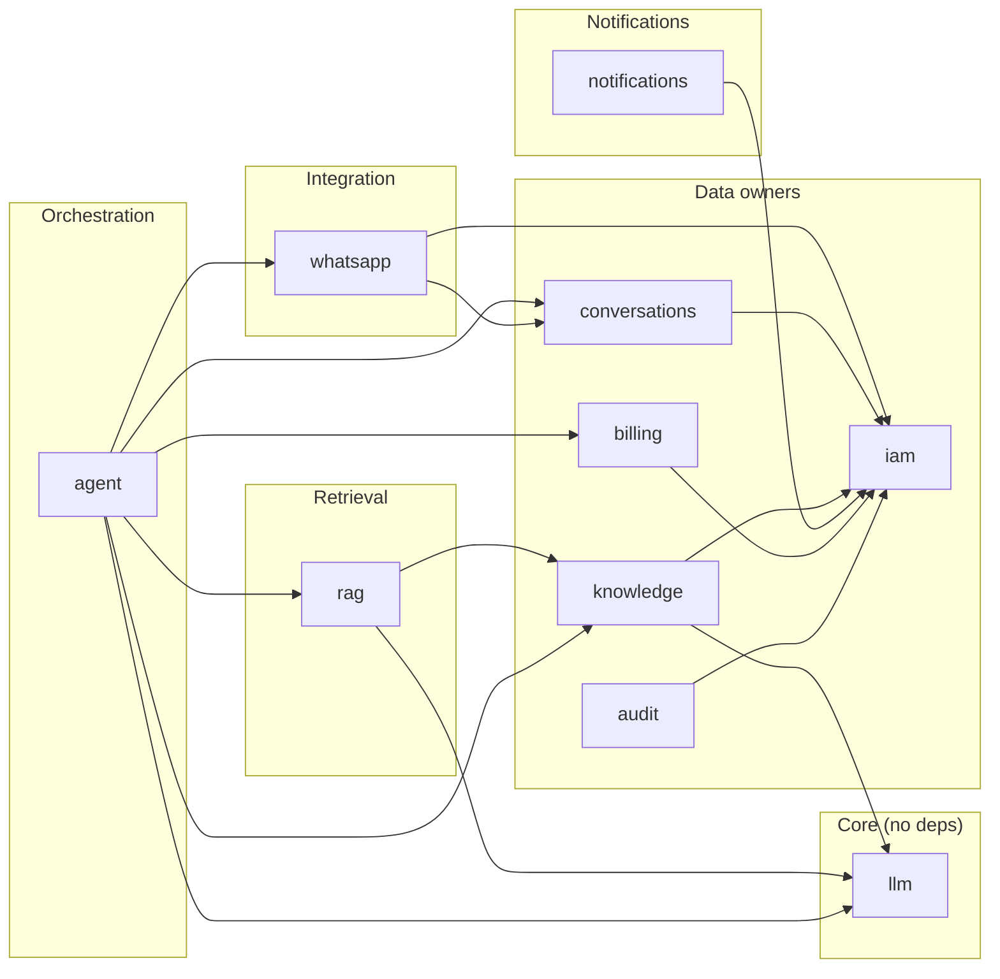

Dependency rules:
1. **Direction is downward**: `agent` is the only orchestrator; `whatsapp`, `knowledge`, `rag`, `llm`, `conversations`, `billing` never depend on `agent`.
2. `llm` has zero dependencies (leaf). `iam` is depended on by everyone (identity is a cross-cutting fact) but depends on nothing domain-specific.
3. Cross-module access goes through the **public `index.ts` contract** of the target module. No `import ... from '../../modules/rag/retrieval/hybrid-search.service'`.
4. **No circular imports** — enforced by lint rule (see section 27).
5. The only port injection across modules: `agent` receives `IWhatsAppProvider` (to send replies) via Nest DI — it depends on the interface, not the adapter.

---

## 11. WhatsApp Architecture

### 11.1 Decision (summary)

**External gateway, integrated through a lean port.** Default provider: **self-hosted OpenWA** (Project A, running as a standalone service). Supported alternative: **Evolution API** (Project B's proven path). Both are reachable through the same `IWhatsAppProvider`; switching is a config value + a small adapter, not an architectural change.

### 11.2 Option evaluation

| Criterion | A. OpenWA embedded in-repo | B. OpenWA SDK directly | C. Abstraction around OpenWA (in-repo) | D. External gateway (OpenWA service / Evolution) |
|---|---|---|---|---|
| Stability | Baileys churn inside business app | SDK churn inside business app | Same churn, hidden behind seam | Churn isolated in gateway container |
| Maintenance | You own session mgmt forever | You own session mgmt forever | Same | Gateway project owns it |
| Community | OpenWA | OpenWA | OpenWA | Evolution: large; OpenWA: growing |
| TS/Nest compat | Native | Native | Native | HTTP API — language-agnostic |
| Session mgmt | Must re-build (state machine, reconnect, LID) | Must re-build | Must re-build | Already built (OpenWA/Evolution) |
| Multi-account | In-process Map, **single instance** (A admits) | Same | Same | Multi-instance, independent lifecycle |
| Horizontal scaling | Blocked by in-process state | Blocked | Blocked | API replicas stateless; gateway scales separately |
| Operational complexity | Highest (embed = second product) | High | High | Low (deploy a container) |
| Vendor lock-in | None (but huge internal debt) | None | None | None (both self-hostable, OpenWA MIT) |
| Testing | Engine tests couple to baileys | Coupled to SDK | Coupled behind seam | Adapter tests mock HTTP — clean |
| Dependency isolation | Poor (every deploy ships baileys) | Poor | Moderate | **Excellent** |
| Reuse of MVP work | Reuses A code as-is but drags it in | Reuses A code but drags it in | Same | **Reuses A as a deployable artifact** (zero merge) |

**Chosen: D.** The seam is kept (the user's port/factory principle is sound) but the adapter is HTTP/webhook-based against a **separately deployed gateway**.

### 11.3 Why this challenges the "abstraction around OpenWA inside the repo" idea

Project A's engine layer is ~5,000 lines of specialized code (session state machine, reconnect storms, LID dialect, message store, media caps, concurrency limiters) and Project A's own docs state it is **in-process and single-instance**. Embedding it means:
- the business monolith cannot scale horizontally;
- every deploy ships the entire WhatsApp gateway and its failure modes;
- AI agents must navigate a 1,300-line adapter and a 1,400-line orchestrator to touch a sales-bot feature;
- we re-acquire a whole product's maintenance burden.

OpenWA already **is** a standalone, documented, tested gateway with a REST API, signed webhooks, WebSockets, and multi-session support. Treating it as a deployment dependency — exactly as Project B treats Evolution — gives all the isolation with none of the merge cost.

### 11.4 Resulting structure

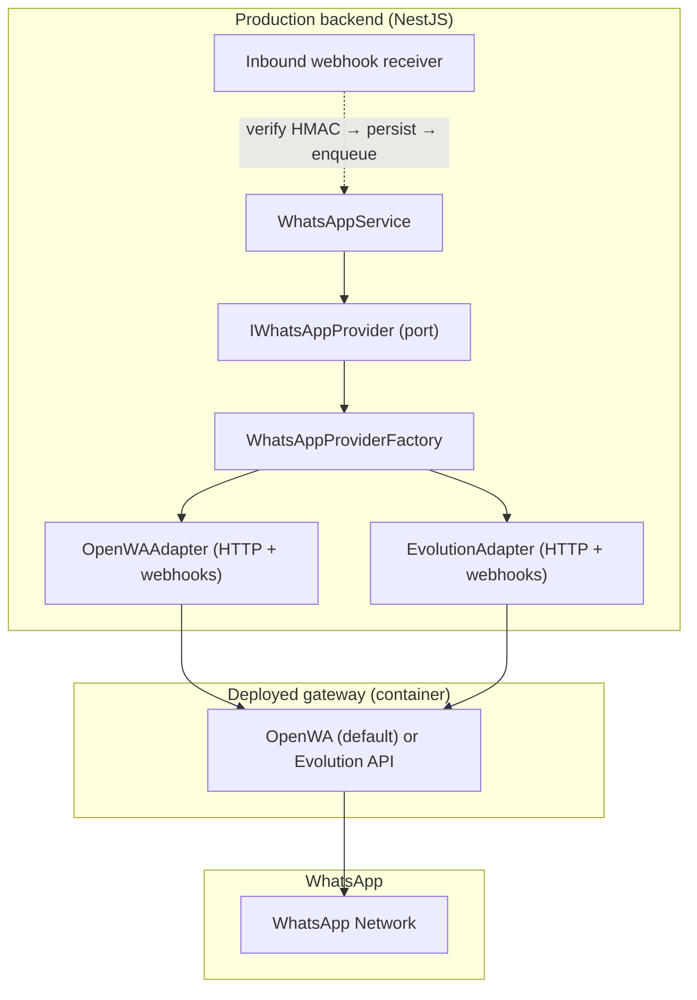

**Where the factory lives:** in `modules/whatsapp/provider/whatsapp-provider.factory.ts`, selected by `WHATSAPP_PROVIDER=openwa|evolution`. The factory belongs in the `whatsapp` module because the port is defined there and the module owns the choice — no other module needs to know a provider exists.

**Do not build a generic port framework** (no microkernel, no registry, no plugin contract). Two adapters, one factory, one interface. If a third provider is ever needed (e.g., Meta Cloud API), add a third adapter class — the pattern already shown by Project B's legacy lane tells us exactly what that looks like.

### 11.5 Webhook security & inbound trust

- Gateway sends events to `POST /api/v1/webhooks/whatsapp/:instanceToken` with an HMAC signature header (OpenWA supports signed webhooks; Evolution supports a path secret — both accepted by the receiver).
- Receiver: verify signature (constant-time), resolve the `whatsapp_links` row by instance token, load tenant, persist message (unique `wa_message_id`), write history, enqueue `ai-reply`, return `202`.
- All gateway outbound HTTP calls from the app go through the shared SSRF-guarded HTTP client (Project A pattern).

---

## 12. RAG Architecture

### 12.1 Placement decision

**Inside the monolith** (modules `knowledge` + `rag` + `llm`). Rationale: RAG is core product logic, reads the same PostgreSQL, has no independent scaling profile, and a microservice would add serialization + network latency to every reply with zero benefit. The heavy parts (embedding, LLM calls) are already async or delegated to external APIs.

### 12.2 Pipeline

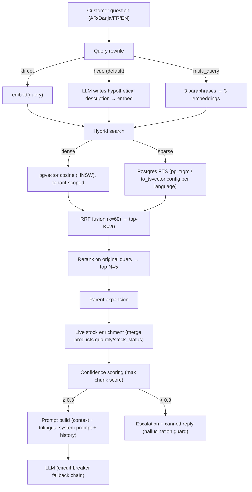

### 12.3 Why Project B's retrieval beats Project A's

Project A's `HybridSearchService` is solid but: no query rewriting, FTS hard-coded to `'english'` (wrong for the product language), no reranking, no parent expansion, no live stock. Project B's `pipeline.py` covers all of those and its `test_retrieval.py` proves cross-lingual retrieval works. **The production system ports Project B's pipeline design to TypeScript**, and keeps from Project A: the **hallucination guard** (confidence < 0.3 → escalate), the **circuit-breaker LLM fallback chain**, and **idempotent ingestion** by `content_hash`.

### 12.4 Ingestion & idempotency

- Products are chunked in a rich-text format (Project B's product format), documents chunked 512 chars / 64 overlap.
- Embedding upsert is idempotent: `(chunk_id, tenant_id)` composite PK, `ON CONFLICT DO UPDATE`; `content_hash` guards re-embedding unchanged content.
- Ingestion is async via BullMQ `ingestion` queue; failed jobs retry with exponential backoff, then go to dead-letter.

---

## 13. Agent Architecture

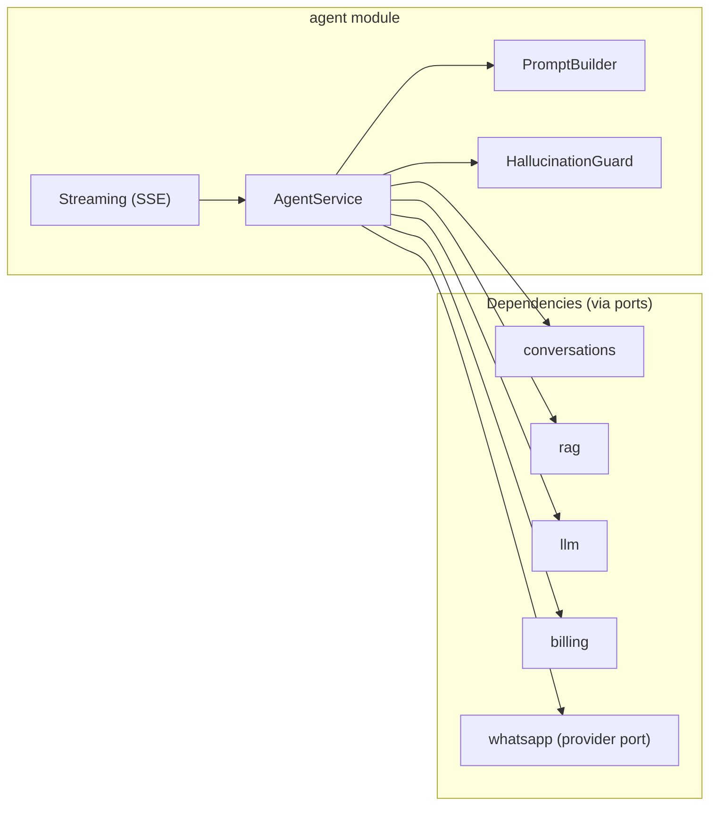

`AgentService` is a thin orchestrator (like Project A's, ~120 lines — intentionally small). It does not contain retrieval math, prompt text, or HTTP calls. Every collaborator is a focused service with its own tests. Streaming reuses the same orchestration with an async generator. The worker consumes `ai-reply` jobs and calls `AgentService.chat()`, then sends via `IWhatsAppProvider`.

---

## 14. Database Architecture

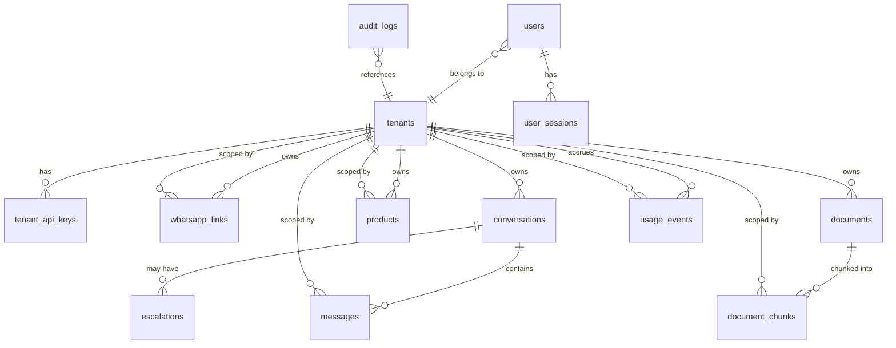

### 14.1 Important tables

| Table | PK | Key fields | Notes |
|---|---|---|---|
| `users` | uuid | email (unique), password_hash, role | from C; `role in ('tenant_owner','admin')` |
| `user_sessions` | uuid | user_id FK, refresh_token_hash, family_id, expires_at, revoked_at | C's rotation + reuse detection |
| `tenants` | uuid | email (unique), name, plan, llm_provider, system_prompt, points_balance, auto_reply, active | from B; `auto_reply` default true |
| `tenant_api_keys` | uuid | tenant_id FK, key_hash (unique), label, revoked | A+B; hash only |
| `whatsapp_links` | uuid | tenant_id FK, provider, gateway_instance_id, instance_token (unique), status, phone, webhook_secret, linked_at | A's `tenant_sessions` + B's `waha_session` merged |
| `wa_jid_mappings` | uuid | lid (unique), wa_jid, tenant_id | A's `lid_mappings` |
| `conversations` | uuid | tenant_id FK, channel, external_id (unique per tenant+channel) | B |
| `messages` | uuid | conversation_id FK, tenant_id, role, content, tokens_used, wa_message_id (unique) , status | B + A dedup + delivery status |
| `escalations` | uuid | tenant_id FK, conversation_id FK, reason, resolved_at | A |
| `products` | uuid | tenant_id FK, name, description, price, currency, quantity, stock_status, active, metadata jsonb | B |
| `documents` | uuid | tenant_id FK, doc_type, title, content_hash (unique per tenant), status | new; ingestion state machine |
| `document_chunks` | (chunk_id, tenant_id) composite | content, embedding vector(768), doc_type, metadata jsonb, parent_chunk_id | B's composite PK + A's parent link |
| `usage_events` | uuid | tenant_id FK, conversation_id, event_type, points_used, tokens_in/out, llm_provider, latency_ms | B |
| `audit_logs` | uuid | tenant_id, action, details jsonb, ip_address | B+A |

**Indexes:** HNSW on `document_chunks.embedding` (vector_cosine_ops); GIN on `document_chunks.metadata` and the FTS column; `(tenant_id)` on every tenant-scoped table; unique `wa_message_id` for dedup; composite `(tenant_id, external_id)` on conversations; `(tenant_id, created_at desc)` on usage_events.

**Soft delete:** used only where the product needs it (products: `active` toggle rather than delete; documents: `status`). Not applied everywhere — KISS.

---

## 15. PostgreSQL Schema Strategy

### 15.1 Decision

**One database, one `public` schema, module-owned tables by naming + code convention.** No `auth.*`, `whatsapp.*`, etc. in the first production release.

### 15.2 Why not schema-per-module now

| Consideration | Single schema | Schema-per-module |
|---|---|---|
| TypeORM migrations | Standard; every migration file just works | Must qualify names, manage `search_path`, risk `schema`/`search_path` drift between CLI and runtime |
| Cross-module FKs | Trivial | Requires same `search_path` or fully-qualified names everywhere |
| Transaction boundaries | App-level (DataSource.transaction) | Same, but cross-schema transactions add nothing here |
| Operational complexity | Low | Higher (per-schema grants, tooling, reporting queries need qualification) |
| Reporting/ad-hoc SQL | Simple | Verbose |
| Isolation benefit | N/A at this scale | Real only when contexts are genuinely independent (teams, deploy units) — not the case here |

The system has **one deployment unit, one team, one database**; the bounded contexts exist in code. If the platform later splits into genuinely independent product lines (e.g., a separate analytics store, or multi-tenant SaaS offering per-module deployments), **migrating to schema-per-module is a mechanical follow-up** — the module boundaries are already aligned with the tables they own. Until then, schema-per-module would be complexity with no payoff.

### 15.3 Enforcement without schemas

- **Ownership convention:** a table belongs to exactly one module (see section 14 mapping). Additive-only evolution.
- **Tenant scoping:** every customer-facing table carries `tenant_id`; composite PK on `document_chunks` includes `tenant_id` (Project B pattern).
- **Migration-first:** `synchronize: false`; all changes via TypeORM migrations (Project C tooling), no raw `.sql` files.

---

## 16. API Architecture

Base path: `/api/v1`. Swagger at `/api/docs` (enabled outside prod, or via `ENABLE_SWAGGER=true`). Global `ValidationPipe` (`whitelist`, `transform`, `forbidNonWhitelisted`). Uniform error envelope (Project C style):

```json
{ "statusCode": 402, "code": "Billing.InsufficientPoints", "message": "Insufficient points balance" }
```

### 16.1 Endpoints (only what the product needs)

| Module | Endpoint | Auth | Notes |
|---|---|---|---|
| health | `GET /health`, `/health/live`, `/health/ready` | none | probes DB + Redis; 503 while draining |
| auth | `POST /auth/register` | none | send OTP, create pending |
| auth | `POST /auth/login` | none | password + device-trust OTP |
| auth | `POST /auth/verify-otp` | none | complete registration or login |
| auth | `POST /auth/refresh-token` | cookie | rotation |
| auth | `POST /auth/logout` | JWT | revoke family |
| auth | `POST /auth/forget-password`, `PUT /auth/reset-password` | none | email link |
| auth | `GET /auth/me` | JWT | profile |
| tenants | `GET/PATCH /tenants/me` | JWT | settings, system_prompt, provider, auto_reply |
| tenants | `POST /tenants/api-keys`, `DELETE /tenants/api-keys/:id` | JWT | hashed keys |
| whatsapp | `POST /whatsapp/link`, `DELETE /whatsapp/link` | JWT | create/remove gateway link |
| whatsapp | `GET /whatsapp/status`, `GET /whatsapp/qr` | JWT | link state + QR |
| whatsapp | `POST /webhooks/whatsapp/:instanceToken` | HMAC | gateway inbound |
| conversations | `GET /conversations` | JWT | paginated inbox |
| conversations | `GET /conversations/:id/messages` | JWT | history |
| knowledge | `POST /products`, `GET /products`, `PATCH /products/:id/quantity`, `PATCH /products/:id/stock`, `DELETE /products/:id` | JWT | catalog |
| knowledge | `POST /documents`, `POST /documents/batch` | JWT | async ingest → 202 |
| chat | `POST /chat`, `POST /chat/stream` | JWT | RAG chat + SSE |
| usage | `GET /usage` | JWT | summary + balance |
| admin | `POST /admin/tenants`, `GET /admin/usage`, `POST /admin/tenants/:id/points` | Admin JWT | platform ops |
| metrics | `GET /metrics` | token | Prometheus text |

**Pagination:** shared `page`/`limit` helper (Project A's `paginate`), consistent response shape.
**Idempotency:** `idempotency-key` header on mutating endpoints that create external side effects (checkout-style, from Project C) — used for `POST /documents/batch` and any retried sends.
**Webhooks:** inbound only, signed, versioned payload envelope `{ event, instance, data }`.

---

## 17. Events and Queues

### 17.1 Decision

**BullMQ as the single async primitive.** No separate event bus in v1. Inter-module communication is:
1. **Direct application-service calls** for synchronous needs (the default);
2. **BullMQ jobs** for anything that should survive a process restart, needs retries, or must not block the HTTP response.

Domain events (Project C primitives) are used **within** a module to decouple its own sub-components (e.g., WebSocket push on message add) — not as a cross-module bus.

### 17.2 Job table

| Job | Producer | Consumer | Sync/Async | Retry | Purpose |
|---|---|---|---|---|---|
| `ai-reply` | whatsapp webhook receiver | agent worker | Async | 3 × exponential, dedup by `wa_message_id` | generate + send the auto-reply |
| `ingestion` | knowledge/catalog API | ingestion worker | Async | 5 × exponential → DLQ | chunk → embed → upsert |
| `email` | iam / notifications | mailer worker | Async | 3 × | OTP, password reset |
| `webhook-delivery` (deferred) | notifications | notifications worker | Async | 5 ×, HMAC-signed | push events to merchant servers |

### 17.3 Async correctness

- **Idempotency:** unique `wa_message_id` on `messages`; jobs re-run safely; `idempotency-key` for client-driven mutations.
- **Ordering:** per-conversation processing is serialized by a Redis lock keyed `conv:<id>` in the ai-reply worker (prevents out-of-order replies to the same customer).
- **Failure:** BullMQ retry with exponential backoff; after max attempts → dead-letter queue + alert metric + escalation row for the conversation.
- **Timeouts:** LLM call budget (e.g., 30s) enforced at the provider adapter; job-level timeout (e.g., 60s).
- **Duplicate messages:** handled at two levels — DB unique constraint and job-level dedup.

---

## 18. Security

| Area | Approach | Source |
|---|---|---|
| Passwords | bcrypt cost 12 | A/B |
| JWT | short access (15 min) + rotating refresh cookie (HttpOnly, Secure, SameSite) with family reuse detection | C + A |
| OTP 2FA | 6-digit, Redis, rate-limited, constant-time compare, trusted devices | B |
| API keys | hash-only storage (HMAC w/ pepper), scope to tenant, revocable | A/B |
| Webhook verification | HMAC signature, constant-time verify; path secret fallback for Evolution | A/B |
| Input validation | global `ValidationPipe` (whitelist + forbidNonWhitelisted) | C |
| Rate limiting | throttler + per-plan Redis sliding window (starter 20 … enterprise 500 RPM) | A/B |
| Secrets | typed env validation + boot-time refusal of default secrets in prod | A |
| SSRF | shared guarded HTTP client for all outbound calls | A |
| Tenant isolation | `tenant_id` on every table + every query; composite PKs on vector rows | B |
| Errors | prod hides internals; uniform error codes | C/A |
| Headers | Helmet, strict CORS (wildcard refused in prod) | A |

**Sensitive data:** never log tokens, keys, or message bodies at `info` or below; API keys shown once; refresh tokens stored hashed.

---

## 19. Reliability

- **Graceful shutdown:** SIGTERM/SIGINT → readiness flips to 503, in-flight jobs allowed to finish, BullMQ workers close cleanly. (From A; C lacks it.)
- **Reconnection:** delegated to the gateway (OpenWA/Evolution handle WhatsApp reconnect + backoff). The app records status transitions only.
- **Provider failure:** LLM circuit breakers + fallback chain; gateway send failures surface as `message.failed` status + retryable job.
- **Idempotency:** unique keys + job dedup + retry-safe handlers.
- **Timeouts:** HTTP client timeouts everywhere (gateway calls, LLM calls), DB `statement_timeout`.
- **DB:** connection pooling (TypeORM pool config), migration-first.
- **Queue durability:** BullMQ on Redis with AOF (production), DLQ + alerts.
- **Backpressure:** worker concurrency limits; per-conversation locking to avoid reply storms.

---

## 20. Observability

- **Structured logging:** JSON logs, `correlationId` propagated via AsyncLocalStorage (request id on every log line; job id on worker logs).
- **Metrics:** Prometheus `/metrics` (token-gated): HTTP latency/status, chat requests, LLM latency + provider fallback counts, ingestion counters, active sessions/links gauge, queue depths (BullMQ exposes), points deducted.
- **Health:** `/health`, `/health/live`, `/health/ready` probing Postgres + Redis (3s timeout), readiness drains on shutdown.
- **Audit:** `audit_logs` for auth + billing + admin actions (best-effort, 90-day retention job).
- **Error tracking:** structured error events + optional Sentry hook (deferred, but logger interface leaves the seam).

---

## 21. Testing Strategy

Simplest strategy that gives strong confidence:

| Level | What | Tooling | Examples |
|---|---|---|---|
| Unit | Pure logic + feature handlers with stubbed deps | Jest (C harness) | RRF fusion, chunker, points math, JWT rotation reuse, fallback-chain ordering, hallucination guard, HMAC verify, each LLM provider DTO mapping |
| Integration | Repositories + auth + webhook persist + vector round-trip against ephemeral Postgres | Jest + Docker (C harness) | register→OTP→login→refresh; webhook→persist→enqueue; ingest→chunk→embed→upsert→search |
| Adapter | WhatsApp adapters against a mocked HTTP client; factory selection | Jest | OpenWA/Evolution send/link/status mapping to neutral shape |
| E2E | Main user journeys over the running app (test DB + mock LLM + mock gateway) | supertest | merchant setup → link → customer message → AI reply sent |
| RAG eval | Retrieval quality across AR/Darija/FR/EN | Script (not CI unit) | adapted from B's `test_retrieval.py`; golden queries per language |

**Rule:** the LLM, the gateway, and SMTP are always mocked/stubbed in automated tests. The only real external thing integration tests use is Postgres (and optionally Redis in-memory mode or real Redis container).

---

## 22. Production Deployment Architecture

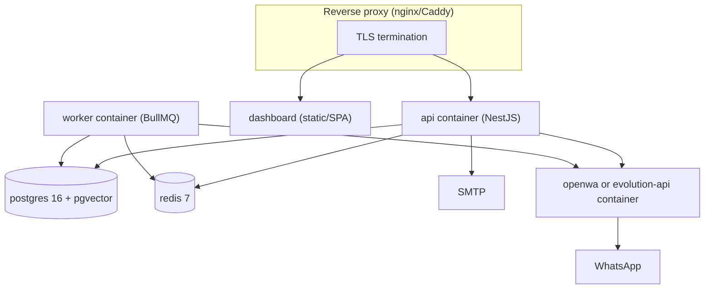

- **Compose services:** `postgres` (pgvector image), `redis` (AOF), `openwa` (Project A image) **or** `evolution-api`, `api`, `worker` (same image, different command), `frontend` (static, served by proxy or Nest).
- **Containers:** non-root user, `cap_drop ALL`, read-only rootfs, resource limits (A's hardening patterns).
- **Config:** 12-factor via env; secrets via a secret manager in prod; boot-time guard refuses placeholder secrets.
- **Horizontal scaling:** `api` and `worker` are stateless (all WhatsApp state lives in the gateway) → scale replicas freely. Gateway is the only stateful boundary and scales by sharding instances per gateway replica (a follow-up concern).

---

## 23. Architectural Decisions / ADRs

### ADR-001 — NestJS over FastAPI
- **Context:** two MVPs, one NestJS (A), one FastAPI (B); production must start from the NestJS boilerplate (C).
- **Options:** NestJS; FastAPI; porting C to FastAPI.
- **Chosen:** NestJS (C as base).
- **Why:** mandated by the base repo; single language; mature DI + ecosystem (BullMQ, throttler, websockets, TypeORM); Project A proves the pattern.
- **Trade-offs:** Python ecosystem (FastAPI) is lost — irrelevant since the only truly good part of B (RAG design) is portable as design, not Python-specific.

### ADR-002 — Modular monolith, not microservices
- **Context:** both MVPs are monoliths; no operational or scaling reason to split.
- **Chosen:** modular monolith with one worker process.
- **Why:** KISS; RAG/agent are latency-sensitive and share the DB; a queue worker is the only justified second process.
- **Trade-offs:** one deployable bounds independent scaling; acceptable.

### ADR-003 — WhatsApp: external gateway behind a port (not embedded OpenWA)
- **Context:** see section 11.
- **Chosen:** `IWhatsAppProvider` port + factory + `OpenWAAdapter` (default, external service) + `EvolutionAdapter` (alternative).
- **Why:** isolation, scaling, maintenance isolation, agent-friendliness; reuses A as a deployable instead of embedding a second product.
- **Trade-offs:** an extra container to operate; a network hop for sends/receives. Both negligible vs. the cost of embedding.

### ADR-004 — Single PostgreSQL schema, not schema-per-module
- **Context:** see section 15.
- **Chosen:** one `public` schema, module-owned tables by convention.
- **Why:** TypeORM schema support adds migration/search_path/FK complexity; no isolation payoff at one-team/one-deploy scale; module boundaries already encode ownership; migration to schemas later is mechanical.
- **Trade-offs:** no hard DB-level isolation between modules; mitigated by tenant scoping + code conventions.

### ADR-005 — TypeORM, migration-first
- **Context:** C ships TypeORM migration-first; A uses TypeORM; B uses raw SQL.
- **Chosen:** TypeORM with `synchronize: false`, all changes via generated migrations.
- **Why:** consistency with base, no ORM lock-in risk (TypeORM is mature), tooling already wired.
- **Trade-offs:** TypeORM's edge-case SQL needs `query()` escapes (pgvector) — accepted; vector ops isolated in `VectorStoreService`.

### ADR-006 — Redis + BullMQ (not Redis Streams)
- **Context:** B uses Redis Streams; A uses BullMQ (optional).
- **Chosen:** BullMQ.
- **Why:** first-class NestJS integration, retries/DLQ/scheduling/UI out of the box, matches A; Redis is required infra either way.
- **Trade-offs:** one more dependency vs. hand-rolled streams; worth it.

### ADR-007 — RAG inside the monolith
- **Context:** see section 12.
- **Chosen:** modules `knowledge` + `rag` + `llm` in-process.
- **Why:** product logic, shared DB, latency, no independent scale profile.
- **Trade-offs:** a future separate embedding service would require moving chunker/embedder — isolated behind `llm` port.

### ADR-008 — LLM provider abstraction (port)
- **Chosen:** `LlmPort` + 3 adapters + circuit-breaker fallback chain (A pattern) + per-tenant provider (B pattern).
- **Why:** real replacement value (providers change, fail, differ in price); B proves per-tenant choice.
- **Trade-offs:** a thin seam — justified.

### ADR-009 — Event-driven vs direct calls
- **Chosen:** direct application-service calls as default; BullMQ jobs for async/durable work; domain events only inside modules.
- **Why:** an in-process event bus would add indirection with no durability; YAGNI.
- **Trade-offs:** module coupling is compile-time (can't hot-swap behavior at runtime) — acceptable.

### ADR-010 — Unified IAM (one auth stack)
- **Chosen:** merge C's users/JWT, A's tenant+admin, B's OTP/trusted devices/API keys into one `iam` module.
- **Why:** A's two-stack auth is duplication; the product needs exactly one identity model (tenant owner + platform admin + machine keys).
- **Trade-offs:** migration effort to unify — contained by starting from C.

### ADR-011 — Points billing in the application layer only
- **Chosen:** remove B's `deduct_points` trigger; deduct once in a transaction in `billing`.
- **Why:** the docs warn of double-deduction; single source of truth for the rule.
- **Trade-offs:** slightly less DB-level enforcement; covered by an integration test for atomicity.

---

## 24. Migration Strategy

Derived from C's existing structure; each phase is independently shippable and keeps the app compiling + tested.

```mermaid
flowchart LR
    P0["Phase 0<br/>Baseline + conventions"] --> P1["Phase 1<br/>Foundation infra"]
    P1 --> P2["Phase 2<br/>Database + IAM"]
    P2 --> P3["Phase 3<br/>WhatsApp port + adapters"]
    P3 --> P4["Phase 4<br/>Conversations + webhook receiver"]
    P4 --> P5["Phase 5<br/>Knowledge + ingestion"]
    P5 --> P6["Phase 6<br/>RAG + LLM"]
    P6 --> P7["Phase 7<br/>Agent orchestration"]
    P7 --> P8["Phase 8<br/>Billing + observability"]
    P8 --> P9["Phase 9<br/>Hardening + deployment"]
```

| Phase | Implement | Depends on | DoD |
|---|---|---|---|
| **0. Baseline** | `AGENTS.md`, docs skeleton, folder conventions, ESLint/Prettier/Tsconfig strict, module-boundary lint rule | — | lint + typecheck + existing tests green; new folder tree in place |
| **1. Foundation** | Config + env validation + boot guards, structured logger + correlation id, error envelope, pagination, Redis provider, BullMQ module, health checks, graceful shutdown | 0 | `/health/*` works; a dummy job round-trips; unit tests |
| **2. DB + IAM** | Postgres migrations for `users`, `user_sessions`, `tenants`, `tenant_api_keys`, audit; register/login/OTP/refresh/logout/me; tenants + api-keys features | 1 | Integration tests: auth lifecycle + tenant isolation |
| **3. WhatsApp port** | `IWhatsAppProvider`, factory, OpenWA adapter, Evolution adapter, `whatsapp_links` migration | 2 | Adapter unit tests with mocked HTTP; factory selection test |
| **4. Conversations** | `conversations`, `messages`, `escalations` tables + services; inbound webhook receiver (HMAC verify → persist → enqueue `ai-reply`) | 2,3 | Integration: signed webhook → row persisted → job enqueued |
| **5. Knowledge** | `products`, `documents`, `document_chunks` (pgvector) + migrations; product CRUD; chunker/embedder/vector-store; ingestion processor | 2,4 | Integration: ingest → search round-trip; idempotent re-ingest |
| **6. RAG + LLM** | `LlmPort` + 3 providers + fallback chain; rewriter (HyDE/multi-query), hybrid search, reranker, pipeline, confidence | 5 | Unit (pipeline components) + RAG eval script; retrieval tests |
| **7. Agent** | `AgentService`, prompt builder, guard, streaming; ai-reply worker end-to-end; per-conversation lock | 6 | E2E: webhook → reply sent (mock gateway + mock LLM) |
| **8. Billing + Obs** | usage events, points deduction, plan RPM limits, metrics, audit wiring, SSE for dashboard | 7 | E2E incl. 402 path; metrics exported |
| **9. Hardening** | rate limiting polish, DLQ + alerts, container hardening, compose, reverse-proxy sample, runbooks | 8 | staging deploy passes health + smoke flows |

---

## 25. Agentic Coding Strategy

### 25.1 The agent contract (what the repository guarantees to an agent)

- Every feature is one file pair (`{Xxx}Endpoint` + `{Xxx}Handler`) with a colocated spec.
- Module public API = `index.ts`; importing anything else across modules is a lint error.
- Dependency direction is enforced by lint; an agent cannot silently create a cycle.
- External providers are always behind ports; agents never import gateway/LLM SDKs outside adapter files.
- All config is typed env; there are no magic strings.

### 25.2 Task template for an agent

```text
GOAL: <one sentence>
MODULE: <name>          (the ONLY module allowed to change)
FILES TOUCHED: <paths>  (expected)
DEPENDENCIES: <which public contracts it uses>
DO NOT TOUCH: <explicit guardrails>
VERIFY: pnpm lint && pnpm typecheck && pnpm test:<scope>
```

### 25.3 Agent workflow (every task)

```text
1. Read AGENTS.md + docs/architecture.md
2. Read the target module's index.ts + README (if present)
3. Identify affected module + its dependencies (public contracts)
4. Inspect the existing feature pattern (read one similar feature)
5. Plan the smallest correct change
6. Implement (new feature file pair; no unrelated edits)
7. Run targeted tests
8. Run typecheck
9. Run lint
10. Re-check module boundaries (index.ts exports only)
11. Report changes + any assumptions
```

---

## 26. Initial Coding Tasks

Ordered, small, agent-safe. Each task ends green.

| Task | Description | Output |
|---|---|---|
| 001 | Analyze boilerplate: read `backend/package.json`, `app.module.ts`, `main.ts`, `common/`, `modules/users/`, `tests/`. Write a short "boilerplate map". | `docs/development/boilerplate-map.md` |
| 002 | Establish conventions: `AGENTS.md`, folder skeleton, lint config (module-boundary rule, import ordering), strict tsconfig. | `AGENTS.md`, config changes |
| 003 | Add shared infra: config module + env validation + boot guards; structured logger + correlation id; error envelope; pagination. | `common/config`, `common/logging`, `common/errors` |
| 004 | Add Redis provider + BullMQ module + `infra/health` + graceful shutdown. | `infra/*` |
| 005 | Database: set up migration-first `data-source.ts` (already exists in C) + first migrations for `users`, `user_sessions`, `tenants`, `tenant_api_keys`, `audit_logs`. | migrations |
| 006 | IAM: port C's auth features to the new layout + add OTP email verification + trusted devices + tenant features + API keys. | `modules/iam` |
| 007 | WhatsApp port: `IWhatsAppProvider` + factory + OpenWA adapter (HTTP) + Evolution adapter (HTTP). | `modules/whatsapp/provider` |
| 008 | WhatsApp link/status features + `whatsapp_links` + `wa_jid_mappings` migrations. | `modules/whatsapp` |
| 009 | Conversations: tables + `ConversationService` + inbox features. | `modules/conversations` |
| 010 | Inbound webhook receiver: HMAC verify → persist → enqueue `ai-reply`. | `modules/whatsapp/features/whatsapp-webhook` |
| 011 | Knowledge: `products`, `documents`, `document_chunks` migrations + product CRUD. | `modules/knowledge` |
| 012 | Ingestion: chunker + embedder client + vector store + `ingestion` processor. | `modules/knowledge/ingestion` |
| 013 | LLM port + Gemini/OpenAI/Qwen adapters + fallback chain + embedder service. | `modules/llm` |
| 014 | RAG: rewriter (direct/HyDE/multi-query), hybrid search, reranker, pipeline, confidence. | `modules/rag` |
| 015 | Agent: `AgentService`, prompt builder, hallucination guard, streaming; wire `ai-reply` worker. | `modules/agent` |
| 016 | Billing: usage events + points deduction (transaction) + plan RPM limits. | `modules/billing` |
| 017 | Observability: metrics + audit wiring + SSE push for the dashboard. | `infra` + modules |
| 018 | E2E suite + compose + runbook skeleton. | `tests/e2e`, `deploy/` |

**Do NOT touch until phase 9:** the dashboard (scope it separately), MCP server, outbound webhooks, media/storage, group/catalog/status modules.

---

## 27. Development Rules

1. **KISS over clever.** No speculative abstraction. No generics puzzles. No framework-layering without a documented reason.
2. **YAGNI.** Don't add a queue/event/port because it "might be useful later" — add it when a real consumer exists.
3. **Module boundaries are law.** Cross-module imports only via `index.ts`. A module never imports another module's internal file.
4. **No circular dependencies.** Enforced by lint (`import/no-cycle`) + the dependency graph in section 10.
5. **Ports only where replacement is real** — `whatsapp`, `llm`. Everything else uses direct service calls.
6. **Migration-first.** Never `synchronize`; every schema change is a TypeORM migration.
7. **Tenant scoping on every query.** No feature ships without a `tenant_id` guard; vector ops use composite PKs.
8. **One file pair per feature.** Endpoint + Handler + DTO + colocated spec. If a feature needs >200 lines, split the handler into services.
9. **No domain code imports infrastructure** (gateway SDKs, LLM SDKs, raw ioredis) — only via ports/injected services.
10. **No debug logging in prod code.** Logs are structured JSON; message bodies are never logged.
11. **Idempotency for anything retried.** Unique keys + job dedup.
12. **Never commit secrets.** Env-only; boot guards refuse placeholders in prod.

---

## 28. Definition of Done

A feature/task is done only when ALL apply:

- [ ] Implements exactly the requirement, nothing more (no speculative additions).
- [ ] Follows the feature pattern; module boundary respected; `index.ts` exports updated if public surface changed.
- [ ] No new dependency without a justification comment in the PR/commit.
- [ ] Typecheck passes (`pnpm build` or `pnpm typecheck`).
- [ ] Lint passes (including module-boundary + cycle rules).
- [ ] Unit tests for the handler + pure logic; integration tests for anything touching DB/Redis.
- [ ] No `console.log`/debug spam; structured logging used.
- [ ] Tenant isolation verified for new queries.
- [ ] Schema change is a migration; no `synchronize` drift.
- [ ] Docs touched if behavior/contract changed (`docs/` or the module README).
- [ ] Agent report lists files touched, dependencies used, and assumptions.

---

## 29. Project Documentation

```text
docs/
├─ architecture.md          # this document (or link to PRODUCTION_ARCHITECTURE.md)
├─ modules/
│  ├─ iam.md
│  ├─ whatsapp.md           # port contract, provider matrix, webhook format
│  ├─ knowledge.md
│  ├─ rag.md                # pipeline + strategy config + eval notes
│  ├─ agent.md
│  └─ billing.md
├─ decisions/
│  └─ adr-001..011.md       # one file per ADR (or keep the single ADR section here)
├─ development/
│  ├─ setup.md              # pnpm, db:init, start:dev
│  ├─ conventions.md        # folder structure, feature pattern, module rules
│  ├─ testing.md            # how to run unit/integration/e2e; RAG eval script
│  └─ debugging.md
├─ operations/
│  ├─ deployment.md         # compose, reverse proxy, secrets
│  └─ runbooks.md           # gateway down, queue backpressure, LLM outage
└─ agents/
   └─ task-template.md      # the agent task template from section 25
```

**`AGENTS.md`** (root) — the machine-readable contract for AI agents: where to start, what patterns to follow, the rules in section 27, the "DO NOT TOUCH" list, and how to verify. Keep it short (~60 lines) and imperative; agents read it first on every session.

---

*End of PRODUCTION_ARCHITECTURE.md. This document is the result of reading all three repositories' source and documentation; it deliberately challenges two of the initial assumptions (embedded OpenWA, schema-per-module) with reasons. Items marked DEFER or NEEDS USER DECISION: MCP server, outbound webhooks to merchant servers, media/storage, WhatsApp Business marketing modules, dashboard scope, payment (Chargily) integration.*
