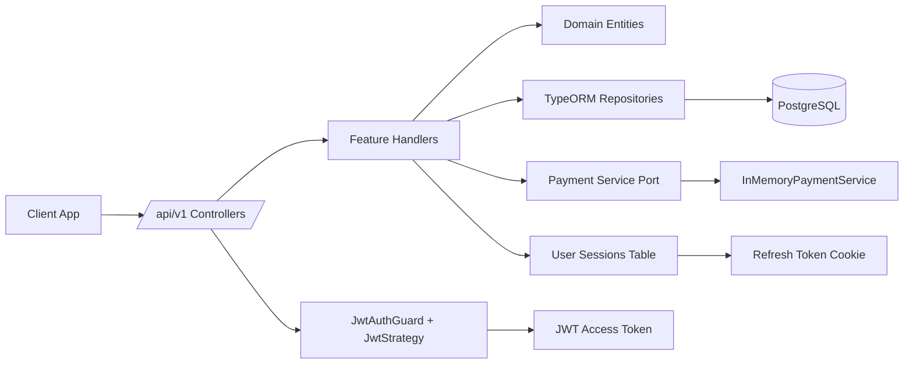
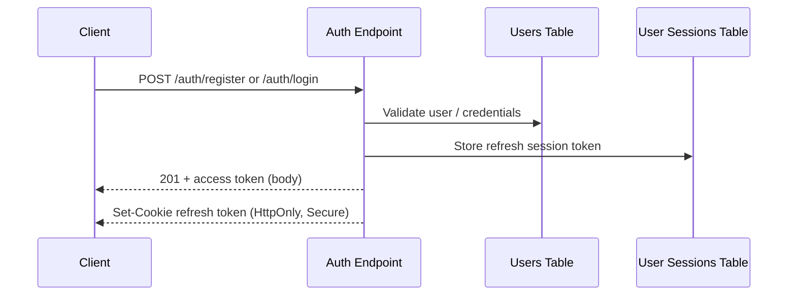
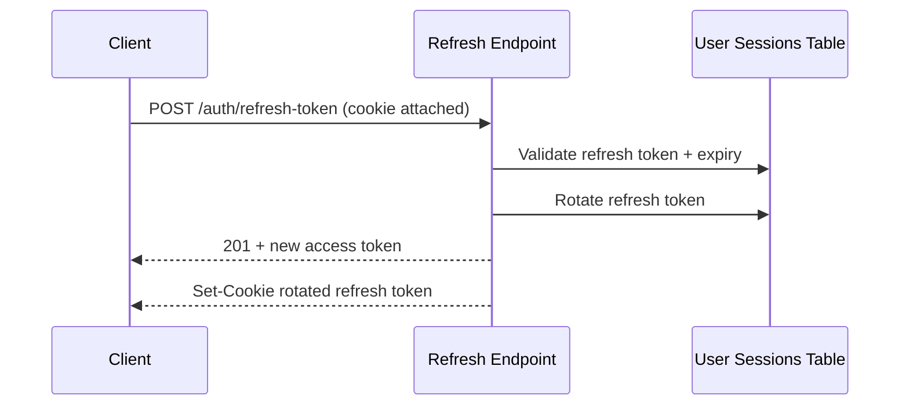
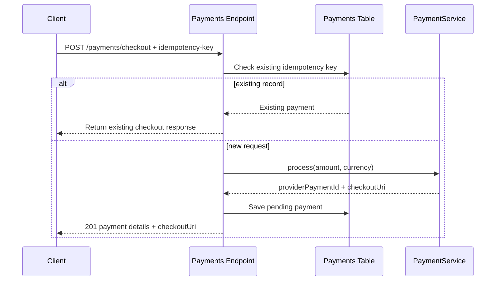

# NestJS Auth Boilerplate


A production-friendly NestJS template for teams who want to **skip setup work** and start building features immediately.

This project gives you a clean starter with:
- JWT authentication (access token + refresh cookie)
- User account flows (register, login, profile, password, email)
- Payment checkout workflow with idempotency and provider abstraction
- PostgreSQL + TypeORM migrations
- Swagger docs, unit tests, and integration tests

## Table of Contents

- [Why This Template](#why-this-template)
- [What Is Included](#what-is-included)
- [High-Level System Design](#high-level-system-design)
- [Request Flows](#request-flows)
- [Folder Structure](#folder-structure)
- [Quick Start](#quick-start)
- [Environment Variables](#environment-variables)
- [Database and Migrations](#database-and-migrations)
- [Run and Test Commands](#run-and-test-commands)
- [API Surface](#api-surface)
- [Production Notes](#production-notes)
- [Customization Guide](#customization-guide)

## Why This Template

Most projects waste time rebuilding the same backend foundation.

This boilerplate is for developers who do **not** want to:
- rewire auth from scratch
- reconfigure TypeORM and migrations every time
- rewrite request validation and API docs plumbing
- start testing setup from zero

Use it as a baseline and focus on product logic.

## What Is Included

- NestJS 11 modular architecture
- PostgreSQL persistence layer with migration-first schema changes
- Auth system:
  - Register / Login / Refresh token / Logout
  - Forget password / Reset password
  - Me endpoint and protected user updates
- Payments module:
  - Checkout endpoint
  - Idempotency key support
  - Payment service abstraction (`PAYMENT_SERVICE`) with in-memory provider implementation
- Swagger UI at `/api/docs`
- Global validation pipeline (`class-validator`, `class-transformer`)
- Testing:
  - Unit tests
  - Integration tests using ephemeral Postgres Docker container

## High-Level System Design



### Design Highlights

- API prefix is `/api/v1`.
- Swagger docs are exposed at `/api/docs`.
- Migrations auto-apply on app startup only when `NODE_ENV=development`.
- Auth uses:
  - Access token in `Authorization: Bearer <token>`
  - Refresh token stored in DB and sent via secure HTTP-only cookie
- Payments follow an idempotent create-checkout pattern (`idempotency-key` header).

## Request Flows

### 1) Register/Login + Session Creation



### 2) Refresh Token Rotation



### 3) Checkout Flow (Idempotent)



## Folder Structure

```text
nestjs-auth-boilerplat/
├─ backend/
│  ├─ src/
│  │  ├─ common/
│  │  │  ├─ auth/                # JWT strategy, guard, current-user decorator
│  │  │  ├─ domain/              # Base entity / domain-event primitives
│  │  │  └─ swagger/             # Swagger setup + reusable API response decorators
│  │  ├─ database/
│  │  │  ├─ migrations/          # TypeORM SQL schema migrations
│  │  │  ├─ create-database.ts   # Creates DB if missing
│  │  │  └─ typeorm.config.ts    # Runtime + data source config
│  │  ├─ modules/
│  │  │  ├─ users/
│  │  │  │  ├─ entities/
│  │  │  │  └─ features/         # Auth and user profile use-cases
│  │  │  └─ payments/
│  │  │     ├─ entities/
│  │  │     ├─ features/         # Checkout endpoint + handler
│  │  │     └─ services/         # Payment service port + provider
│  │  ├─ app.module.ts           # Root module wiring
│  │  └─ main.ts                 # App bootstrap
│  ├─ tests/
│  │  ├─ unit-tests/
│  │  └─ integration/            # Docker-backed Postgres integration tests
│  └─ package.json
└─ LICENSE
```

## Quick Start

### Prerequisites

- Node.js LTS (20+ recommended)
- pnpm 10+
- PostgreSQL
- Docker (optional, required for integration tests)

### 1) Install dependencies

```bash
cd backend
pnpm install
```

### 2) Configure environment

```bash
cp .env.example .env
```

Update `.env` values if needed.

### 3) Create DB and run migrations

```bash
pnpm run db:init
```

### 4) Start development server

```bash
pnpm run start:dev
```

App URLs:
- API base: `http://localhost:3000/api/v1`
- Swagger: `http://localhost:3000/api/docs`

## Environment Variables

| Variable | Required | Default | Description |
|---|---|---|---|
| `PORT` | No | `3000` | HTTP port |
| `NODE_ENV` | Yes | `development` | Environment mode |
| `DATABASE_HOST` | Yes | `localhost` | PostgreSQL host |
| `DATABASE_PORT` | Yes | `5432` | PostgreSQL port |
| `DATABASE_USERNAME` | Yes | `postgres` | PostgreSQL username |
| `DATABASE_PASSWORD` | Yes | `postgres` | PostgreSQL password |
| `DATABASE_NAME` | Yes | `auth` | Target database name |
| `JWT_SECRET_KEY` | Yes | - | JWT signing secret |
| `JWT_ISSUER` | Yes | - | JWT issuer claim |
| `JWT_AUDIENCE` | Yes | - | JWT audience claim |
| `JWT_ACCESS_TOKEN_LIFETIME_MINUTES` | No | `50` | Access token lifetime |
| `REFRESH_TOKEN_COOKIE_NAME` | No | `refreshToken` | Cookie name for refresh token |
| `REFRESH_TOKEN_DAYS` | No | `7` | Refresh token expiration in days |

## Database and Migrations

This template is migration-first (`synchronize: false`).

Available commands:

```bash
pnpm run db:create
pnpm run db:migration:run
pnpm run db:migration:revert
pnpm run db:migration:generate
pnpm run db:init
```

Notes:
- `db:create` creates `DATABASE_NAME` if it does not exist.
- The DB user must have permission to create databases.
- On startup, pending migrations are auto-applied only in development mode.

## Run and Test Commands

```bash
pnpm run start:dev          # Dev server with watch mode
pnpm run build              # Build production artifacts
pnpm run start:prod         # Run compiled app
pnpm run lint               # ESLint
pnpm run test               # Default Jest tests
pnpm run test:unit          # Unit tests only
pnpm run test:integration   # Integration tests only (requires Docker)
pnpm run test:cov           # Coverage
```

## API Surface

Base prefix: `/api/v1`

### App
- `GET /` - Health/welcome message

### Auth
- `POST /auth/register`
- `POST /auth/login`
- `POST /auth/refresh-token`
- `POST /auth/logout`
- `POST /auth/forget-password`
- `PUT /auth/reset-password`
- `GET /auth/me`

### Users
- `POST /users/change-password`
- `PATCH /users/change-email`
- `PUT /users/update-profile`

### Payments
- `POST /payments/checkout`

Payment checkout requires:
- Bearer access token
- `idempotency-key` header
- Body: `amount`, `currency`

## Production Notes

- Refresh cookies are set with:
  - `httpOnly: true`
  - `secure: true`
  - `sameSite: none`
- For browser-based clients, run behind HTTPS in production (and typically in staging).
- Rotate and secure `JWT_SECRET_KEY` using your secret manager.
- Replace `InMemoryPaymentService` with a real provider implementation.
- Add rate limiting, audit logging, and email delivery for reset-password flow before go-live.

## Customization Guide

Typical next steps for teams:

1. Replace payment provider implementation behind `PAYMENT_SERVICE`.
2. Add your email adapter to send real reset-password links.
3. Extend `UserEntity` and user profile endpoints for your domain.
4. Add business modules (appointments, billing, notifications, etc.) using the same feature-handler pattern.

---

If you want a starter that already handles auth + DB + testing structure, this template is built to save that setup time and let you ship features faster.
